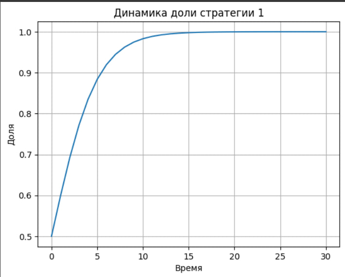

---
## Front matter
title: "Динамический репликатор"
subtitle: "Реферат"
author: "Горяйнова Алёна Андреевна"

## Generic otions
lang: ru-RU
toc-title: "Содержание"

## Bibliography
bibliography: bib/cite.bib
csl: pandoc/csl/gost-r-7-0-5-2008-numeric.csl

## Pdf output format
toc: true # Table of contents
toc-depth: 2
lof: true # List of figures
lot: true # List of tables
fontsize: 12pt
linestretch: 1.5
papersize: a4
documentclass: scrreprt
## I18n polyglossia
polyglossia-lang:
  name: russian
  options:
	- spelling=modern
	- babelshorthands=true
polyglossia-otherlangs:
  name: english
## I18n babel
babel-lang: russian
babel-otherlangs: english
## Fonts
mainfont: IBM Plex Serif
romanfont: IBM Plex Serif
sansfont: IBM Plex Sans
monofont: IBM Plex Mono
mathfont: STIX Two Math
mainfontoptions: Ligatures=Common,Ligatures=TeX,Scale=0.94
romanfontoptions: Ligatures=Common,Ligatures=TeX,Scale=0.94
sansfontoptions: Ligatures=Common,Ligatures=TeX,Scale=MatchLowercase,Scale=0.94
monofontoptions: Scale=MatchLowercase,Scale=0.94,FakeStretch=0.9
mathfontoptions:
## Biblatex
biblatex: true
biblio-style: "gost-numeric"
biblatexoptions:
  - parentracker=true
  - backend=biber
  - hyperref=auto
  - language=auto
  - autolang=other*
  - citestyle=gost-numeric
## Pandoc-crossref LaTeX customization
figureTitle: "Рис."
tableTitle: "Таблица"
listingTitle: "Листинг"
lofTitle: "Список иллюстраций"
lotTitle: "Список таблиц"
lolTitle: "Листинги"
## Misc options
indent: true
header-includes:
  - \usepackage{indentfirst}
  - \usepackage{float} # keep figures where there are in the text
  - \floatplacement{figure}{H} # keep figures where there are in the text
---

# Аннотация

В данной работе рассматривается модель динамического репликатора, происходящая из эволюционной теории игр. Модель позволяет описывать, как изменяются доли различных типов стратегий в популяции в зависимости от их эффективности (приспособленности). Работа содержит как теоретическое описание уравнений модели, так и практический численный пример, демонстрирующий поведение системы. Обсуждаются свойства модели, ограничения и возможные области применения.

# Введение

Эволюционные модели занимают важное место в современном научном анализе систем, где происходят процессы конкуренции, отбора и адаптации. Одной из ключевых моделей такого рода является **динамический репликатор**.

Модель позволяет описывать, как стратегии (или типы) распространяются или исчезают в популяции в зависимости от того, насколько они эффективны по сравнению с другими. Это может быть применимо к биологическим видам, экономическим агентам, алгоритмам машинного обучения и даже к повседневным привычкам людей (например, выбору между браузерами или соцсетями).

# Цель и задачи исследования

**Цель работы** — исследовать свойства и поведение модели динамического репликатора, показать её применение на примере, а также обсудить интерпретацию полученных результатов.

**Задачи:**

- Формально описать модель и объяснить математический смысл уравнения;
- Провести численное моделирование на простом примере (две стратегии);
- Проанализировать поведение модели и сделать выводы о её свойствах и применимости.

# Теоретическая часть

## Уравнение динамического репликатора

Модель описывается следующим уравнением:

$$
Pr_{t+1}(i) = \frac{Pr_t(i) \cdot \pi(i)}{\sum_{j=1}^{N} Pr_t(j) \cdot \pi(j)}
$$

Здесь:
- $Pr_t(i)$ — доля типа (или стратегии) $i$ в популяции на момент времени $t$;
- $\pi(i)$ — эффективность ("полезность") типа $i$;
- Числитель — рост пропорции типа $i$ пропорционален его собственной эффективности;
- Знаменатель — нормировка: средняя эффективность всей популяции.

Это уравнение означает, что стратегия, которая даёт больше прибыли, будет расти в популяции быстрее.

## Интерпретация модели

Модель имеет следующее поведение:

- Если у типа эффективность выше средней, его доля растёт.
- Если эффективность ниже средней — уменьшается.
- Если равна средней — остаётся постоянной.

Таким образом, модель естественным образом приводит к вытеснению менее эффективных стратегий.

## Свойства модели

- **Детерминированность** — при фиксированных начальных условиях результат всегда один и тот же;
- **Нелинейность** — могут существовать несколько устойчивых состояний (равновесий);
- **Монотонность** — доминирующие стратегии стабильно растут;
- **Отсутствие инноваций** — модель не учитывает появление новых стратегий (нет мутаций);
- **Простота численной реализации** — можно моделировать в Python, Excel и других инструментах.

# Практический пример: конкуренция браузеров

Для иллюстрации возьмём следующий пример.

Пусть:
- Есть две стратегии: использовать Chrome или Opera;
- Начальные доли обеих стратегий — по 50%;
- Эффективность (приспособленность): Chrome — 1.2, Opera — 0.8.

Моделируем 30 шагов времени:

```python
import matplotlib.pyplot as plt

p = [0.5]  # доля Chrome
fitness = [1.2, 0.8]  # Chrome, Opera

for t in range(30):
    p_t = p[-1]
    avg = p_t * fitness[0] + (1 - p_t) * fitness[1]
    p_next = (p_t * fitness[0]) / avg
    p.append(p_next)

plt.plot(p)
plt.title("Доля стратегии Chrome во времени")
plt.xlabel("Время")
plt.ylabel("Доля Chrome")
plt.grid(True)
plt.savefig("replicator_browser.png")
```

## Результаты моделирования

На графике (рис. @fig:001) видно, как доля стратегии Chrome стремительно возрастает от 0.5 до почти 1. Это демонстрирует вытеснение менее эффективной стратегии (Opera), даже если стартовые условия равны.

{#fig:001 width=70%}

Результат интуитивно понятен: пользователи постепенно переходят к более удобному браузеру, и со временем его доля становится почти 100%.

# Области применения

Модель динамического репликатора используется в самых разных областях:

- **Биология**: эволюция генов, устойчивость экосистем;
- **Экономика**: конкуренция фирм, распространение технологий;
- **Социология**: мода, распространение убеждений;
- **Алгоритмы**: обучение агентов в многократных играх;
- **Экология**: взаимодействие видов (хищник-жертва и т.д.).

# Заключение

Модель динамического репликатора — мощный инструмент анализа адаптивных систем, в которых "выживает сильнейший". Несмотря на простоту, модель позволяет качественно описывать динамику поведения стратегий и их эволюцию во времени.

Численный пример с браузерами показывает, как даже небольшое различие в эффективности ведёт к значительному смещению в популяции. Это делает модель полезной как в теоретических, так и в прикладных задачах.

# Список литературы

1. Weibull J.W. *Evolutionary Game Theory*. MIT Press, 1995.  
2. Hofbauer J., Sigmund K. *Evolutionary Games and Population Dynamics*. Cambridge University Press, 1998.  
3. Nowak M.A. *Evolutionary Dynamics*. Harvard University Press, 2006.  

---
